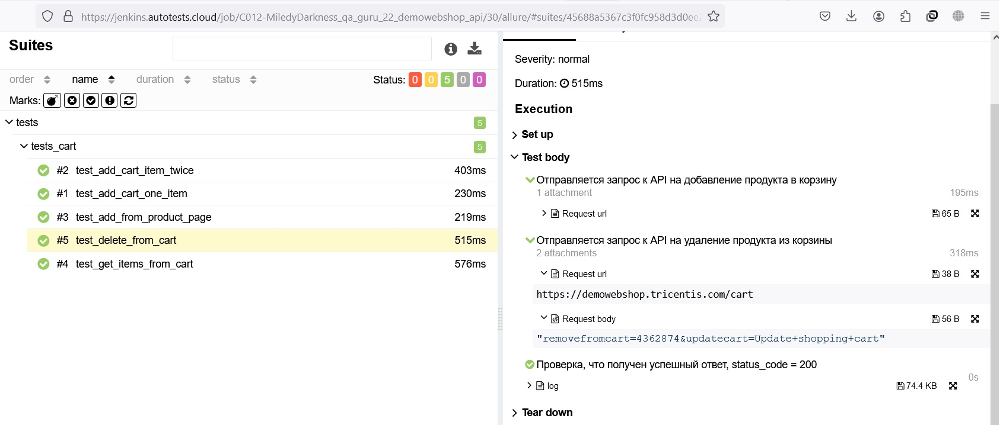
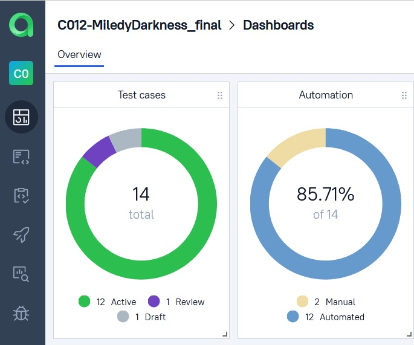
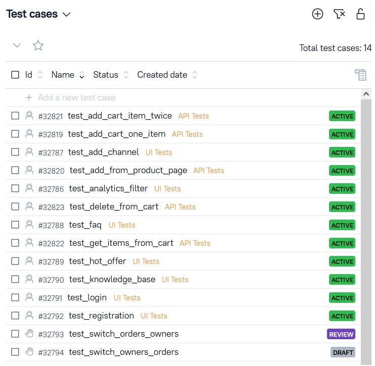
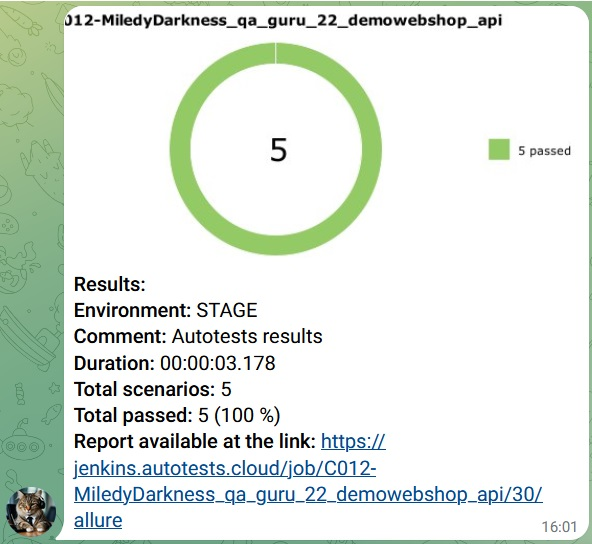

#### Здесь представлено несколько простых автотестов API для сайта https://demowebshop.tricentis.com
<h6>
<ul>
<li>Все тесты реализованы с использованием шаблона <i>PageObject</i></li>
<li>Разработаны на <i>Python</i></li>
<li>Запускаются из <i>Jenkins</i></li>
<li>В результате генерируется отчет при помощи <i>Allure</i> и отправляется нотифкация в <i>Telegram</i></li>
<li>Готовый отчет, а также тест-кйсы доступны в <i>Allure TestOps</i></li>
</ul>
</h6>

<h2>Description</h2>
<li><a href="#tools">Инструменты</a></li>
<li><a href="#tests">Тесты</a></li>
<li><a href="#run-tests">Запуск тестов</a></li>
<li><a href="#test-example">Примеры</a></li>

---

<h2 id="tools">Инструменты</h2>

    
        
    
    
    
    
    
    
    
    

---

<h2 id="tests">Автоматизированные тесты</h2>
<ul>
<li>Добавление в корзину одного товара</li>
<li>Добавление в корзину двух одинаковых товаров</li>
<li>Добавление в корзину со страницы товара с выбором доп. характеристик</li>
<li>Получение всех предметов в корзине</li>
<li>Удаление предмета из корзины</li>
</ul>

---

<h2 id="run-tests">Запуск тестов</h2>

<pre>
    python -m venv .venv
    source .venv/bin/activate
    pip install -r requirements.txt
    pytest ${TESTS_FOLDER} || true
</pre>

---

<h2 id="test-example">Примеры запуска</h2>

<h3>Jenkins</h3>

https://jenkins.autotests.cloud/job/C012-MiledyDarkness_qa_guru_22_demowebshop_api/

#### Пример выполнения одного теста

---
<h3>Allure TestOps</h3>

https://allure.autotests.cloud/project/4277/dashboards

#### Совместное хранение ручных и автоматизированных тест-кейсов

---

#### Сообщение в телеграмм 

